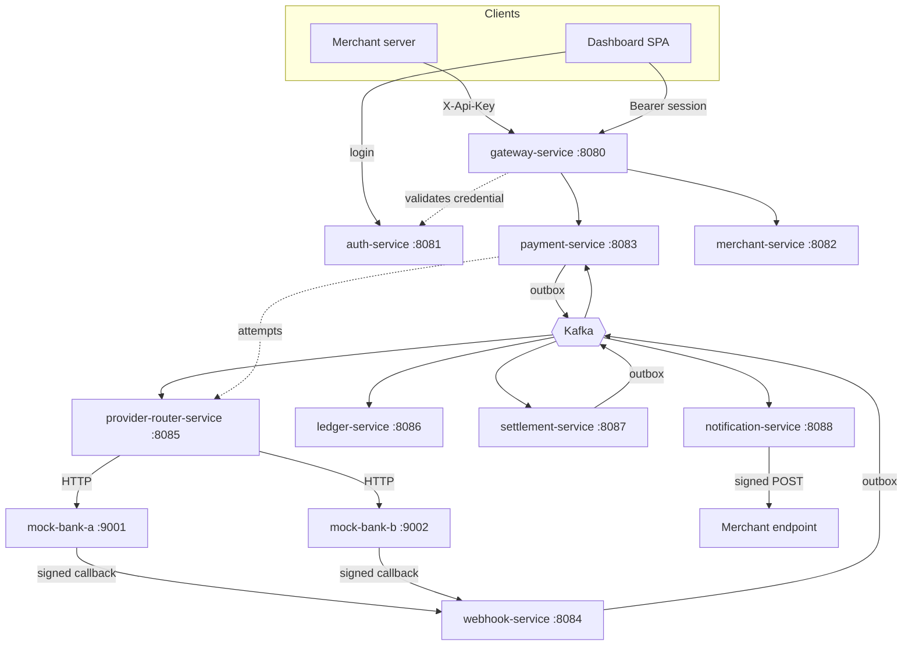
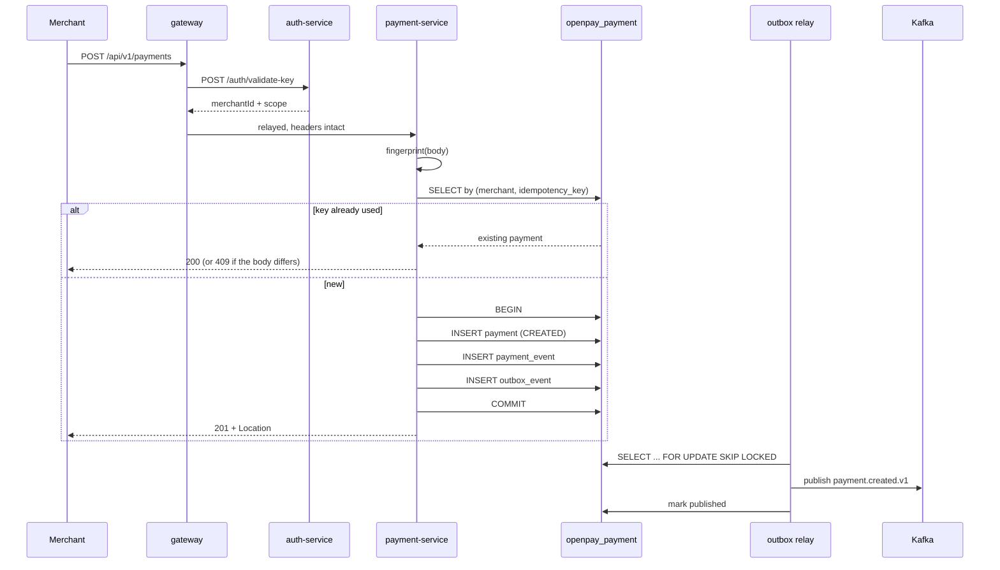
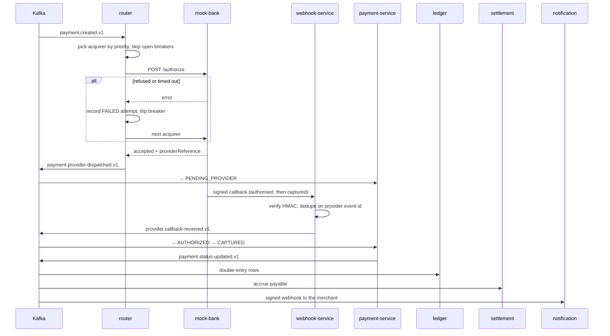
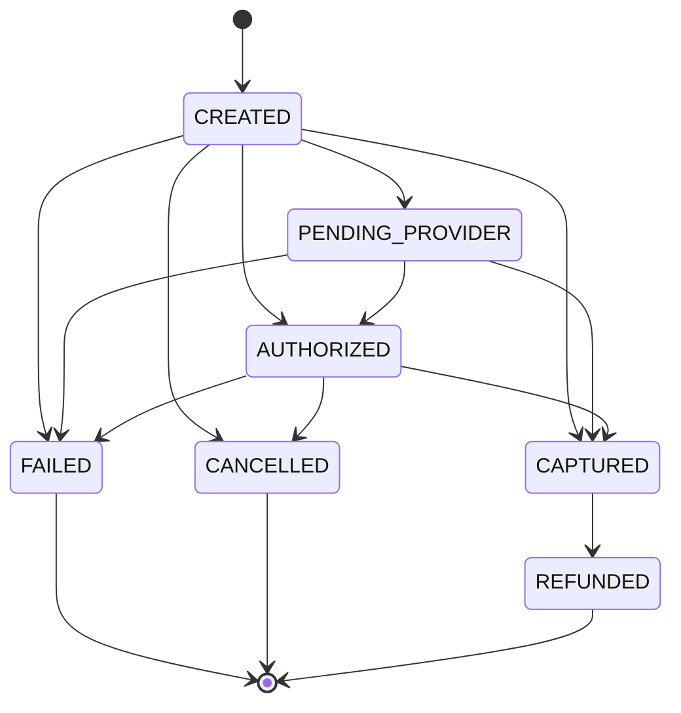

# OpenPay Architecture

What every component is, what happens on each request, and what breaks when a piece goes down.

- [1. The shape of the system](#1-the-shape-of-the-system)
- [2. Trust boundaries](#2-trust-boundaries)
- [3. What happens when you…](#3-what-happens-when-you)
- [4. The building blocks](#4-the-building-blocks)
- [5. Failure modes](#5-failure-modes)
- [6. Data model](#6-data-model)

Diagrams for all of this live in [docs/diagrams/](diagrams/), and the decisions behind it in
[docs/adrs/](adrs/).

---

## 1. The shape of the system

Twelve processes, nine databases, one Kafka cluster. Every service owns its schema outright; no
service reads another's tables. Anything one service needs from another it gets over HTTP (when it
needs an answer now) or from Kafka (when it needs to know something happened).

| Service | Port | Database | Owns |
| --- | --- | --- | --- |
| gateway-service | 8080 | — | The front door. Authenticates, then relays. |
| auth-service | 8081 | `openpay_auth` | API keys, dashboard users, sessions. |
| merchant-service | 8082 | `openpay_merchant` | Merchants and their webhook configuration. |
| payment-service | 8083 | `openpay_payment` | Payments, refunds, idempotency, the state machine, an outbox. |
| webhook-service | 8084 | `openpay_webhook` | Inbound acquirer callbacks. The trust boundary. |
| provider-router-service | 8085 | `openpay_router` | Acquirer choice, failover, circuit breakers, attempt history. |
| ledger-service | 8086 | `openpay_ledger` | Double-entry journal. Append-only, enforced by trigger. |
| settlement-service | 8087 | `openpay_settlement` | Fee calculation, payout batching, an outbox. |
| notification-service | 8088 | `openpay_notification` | Signed outbound webhooks to merchants, with retries. |
| fraud-service | 8089 | `openpay_fraud` | Risk rules, screening decisions, and the review queue. |
| mock-bank-service | 9001, 9002 | — | Two simulated acquirers. One codebase, run twice. |
| web/dashboard | 5173 | — | React SPA. A client of the public API, nothing more. |

Shared libraries in `libs/`: `common-observability` (correlation IDs), `common-security` (the three
authentication filters and CORS), `common-kafka` (topic names, the event envelope, DLQ naming),
`common-outbox` (the transactional outbox and its relay).



Read that diagram as three layers. **Synchronous, merchant-facing**: everything through the
gateway, which answers in milliseconds. **Asynchronous, event-driven**: everything through Kafka,
which is how a payment gets from `CREATED` to `CAPTURED` without the merchant doing anything.
**Outbound**: the two places the platform talks to the outside world — the router calling acquirers
and notification-service calling merchants.

---

## 2. Trust boundaries

Four kinds of caller, and the system treats them very differently.

| Caller | Credential | Checked by | Reaches |
| --- | --- | --- | --- |
| Merchant server | `X-Api-Key` | `ApiKeyAuthenticationFilter` → auth-service | Payments, refunds, own settlements, own deliveries |
| Dashboard user | `Authorization: Bearer` | `JwtAuthenticationFilter` (local signature check) | The same paths as an API key |
| Platform operator | `X-Admin-Token` | `AdminTokenFilter` (constant-time compare) | Merchants, API keys, dashboard users, webhook-secret rotation |
| Platform operator | `X-Ops-Token` | `AdminTokenFilter` (constant-time compare) | Ledger, settlement runs, cross-merchant deliveries |
| Another service | `X-Internal-Token` | `AdminTokenFilter` (constant-time compare) | Router attempts, merchant webhook config |
| Acquirer | HMAC-SHA256 over `timestamp.body` | `SignatureVerifier` | Callbacks only |

The three operator/service tiers are separate secrets on purpose. The line between them is *does
this create a credential* — not *is this sensitive*. The ledger is highly sensitive and sits on the
ops tier anyway, because reading it mints nothing; issuing an API key sits on the admin tier
because that key then does everything it is scoped for, indefinitely. Leaking the reporting token a
dashboard uses should not hand over merchant onboarding.

**Filter order matters and is deliberate.** In `SecurityAutoConfiguration`, ordered from
`Ordered.HIGHEST_PRECEDENCE`:

```
+0   CorrelationIdFilter      every request gets an id, even a rejected one
+8   CorsFilter               preflights carry no credential, so they are answered first
+9   JwtAuthenticationFilter  a bearer token, if present, becomes the principal
+10  ApiKeyAuthenticationFilter   skipped entirely if a principal already exists
+11  AdminTokenFilter         credential-minting operator paths
+12  InternalTokenFilter      service-to-service paths
+13  OpsTokenFilter           operator reporting and administration
+20  RateLimitFilter          gateway only, and last: it charges an authenticated merchant
```

`RateLimitFilter` sitting after every authentication filter is the point, not an accident. A
request that reaches it has already had an invalid credential rejected, so the limiter counts real
merchant traffic instead of somebody guessing at API keys.

The two merchant filters converge on the same object:

```java
request.setAttribute("openpay.principal", new ApiKeyPrincipal(merchantId, role));
```

That is the whole point. A controller does not know or care whether a server presented a key or a
person presented a session — it reads `principal.merchantId()` and scopes its query. **Merchant
identity is never read from a client-supplied header.** A request carrying `X-Merchant-Id` is
ignored; the acceptance suite asserts that spoofing it gets a 401.

### The one rule every read obeys

Every merchant-facing query filters on the merchant from the validated credential:

```java
paymentRepository.findByIdAndMerchantId(paymentId, principal.merchantId())
        .orElseThrow(() -> new PaymentNotFoundException(paymentId));
```

Note it throws **not-found**, not forbidden. Another merchant's payment does not exist as far as
you are concerned — telling you it exists but is not yours is itself a disclosure.

---

## 3. What happens when you…

### 3.1 …create a payment

`POST /api/v1/payments` with `X-Api-Key`, `Idempotency-Key`, and a body.



Step by step:

1. **Gateway authenticates.** `ApiKeyAuthenticationFilter` calls auth-service, which looks the key
   up by its public prefix, hashes the presented secret with SHA-256, and compares constant-time. A
   wrong prefix and a wrong secret produce the identical error, so the endpoint cannot be used to
   discover which prefixes are real.
2. **Gateway relays.** `ReverseProxy` copies every header except the hop-by-hop set
   (`connection`, `transfer-encoding`, `content-length`, `host`, …) and CORS response headers. It
   is a conduit: downstream status codes come back verbatim rather than being reinterpreted.
3. **Payment-service fingerprints the body.** SHA-256 over the canonical request. This is what makes
   idempotency honest — see [4.2](#42-idempotency).
4. **One transaction writes three rows.** The payment, an audit `payment_event`, and an
   `outbox_event`. Either all three commit or none do. The event physically cannot escape without
   the payment, and the payment cannot commit without the event.
5. **Response is immediate.** `201 CREATED` with a `Location` header. The payment is in status
   `CREATED` and nothing has touched an acquirer yet.
6. **The outbox relay picks it up** within ~500 ms and publishes to `payment.created.v1`, keyed by
   payment id.

The merchant's request is done. Everything after this happens on its own.

### 3.2 …wait three seconds (the asynchronous flow)

Nobody calls anything. This is the part that makes it a payment gateway rather than a CRUD app.



Two details worth knowing:

**The two topics have no mutual ordering.** `payment.provider-dispatched.v1` and
`provider.callback-received.v1` are separate topics, so nothing guarantees the dispatch notice
arrives before the callback. If the callback wins the race, the payment is still in `CREATED` when
`AUTHORIZED` arrives. That is why the state machine allows `CREATED → AUTHORIZED` and
`CREATED → CAPTURED` directly — refusing them would strand the payment in `PENDING_PROVIDER`
forever once the late dispatch notice landed.

**A callback is the instruction that releases funds**, which is exactly why webhook-service verifies
the HMAC over the *raw* body before parsing it, and refuses any provider it has no secret for. The
signature covers `timestamp.body`, so a callback captured off the wire stops being usable after
five minutes rather than staying valid forever.

### 3.3 …read a payment

`GET /api/v1/payments/{id}`. Gateway authenticates, relays to payment-service, which scopes by
merchant and returns. No Kafka, no other service, one indexed query. Listing adds
`?page&size&status`, all pushed to the database — a page that filtered after fetching would report
the wrong total.

### 3.4 …ask what was tried

`GET /api/v1/payments/{id}/attempts`.

payment-service **fetches the payment first** — that is the authorisation check, since it throws for
a payment belonging to someone else — then calls provider-router-service over HTTP with a 1 s
connect and 2 s read timeout.

The router owns this data. A local projection built from routing events would decouple the read at
the cost of two tables that can disagree, which is a bad trade for a payments platform. If the
router is unreachable the endpoint returns **503 `attempts_unavailable`**, never an empty list:
"nothing was tried" and "could not ask" are different answers.

### 3.5 …refund a payment

`POST /api/v1/refunds` with an `Idempotency-Key`.

1. Payment must exist, belong to you, and be `CAPTURED`.
2. **Over-refund check.** `sumCommittedAmount` totals every non-`FAILED` refund. `PENDING` counts —
   a refund in flight has money on its way out, and ignoring it would let concurrent requests refund
   more than the payment was worth. `FAILED` releases the amount again.
3. Refund row + outbox event in one transaction, status `PENDING`.
4. Router picks it up from `refund.created.v1`, calls the acquirer, the acquirer calls back, and the
   refund moves to `SUCCEEDED`.
5. When successful refunds total the full payment, the payment moves `CAPTURED → REFUNDED` — routed
   through `PaymentService.applyTransition` so it emits `payment.status-updated.v1` like every other
   transition. Writing the entity directly moved the payment but told nobody, leaving the ledger,
   settlement, and the merchant's webhook unaware.
6. Settlement applies **carry-forward**: a refund larger than the current window's payables makes the
   window negative, and the deficit carries into the next one rather than being written off.

### 3.6 …sign in to the dashboard

`POST /api/v1/auth/login` against auth-service directly — not through the gateway, because the
gateway's merchant paths demand a credential the user does not have yet.

1. Email is lowercased and looked up.
2. **If no user exists, BCrypt is still run against a dummy hash.** Without that, a missing account
   returns faster than a wrong password, and the endpoint becomes a way to enumerate who has one.
3. Failures are counted per email by `ValidationAttemptLimiter`.
4. On success: an HS256 JWT carrying `sub`, `merchantId`, `email`, `role`, 1 h expiry.

Every service that accepts sessions holds the same secret and verifies **locally** — no call back to
auth-service per request. The cost is that a disabled user stays valid until expiry; the expiry is
short to bound it.

### 3.7 …settle

On a cron (`0 0 2 * * *`), or `POST /api/v1/settlements/run`.

Captured payments past the hold period are gathered, fees applied (200 bps by default), net
computed, a settlement row written with an outbox event, and `settlement.created.v1` published. The
ledger consumes it and books the payable against the merchant's balance. The settlement total must
reconcile against the ledger, and the global invariant — debits minus credits across every entry —
must stay exactly zero.

### 3.8 …when the platform calls a merchant

notification-service consumes `payment.status-updated.v1` and `refund.succeeded.v1`, fetches the
merchant's URL and signing secret, signs the payload with HMAC-SHA256, and POSTs. Failures retry
with exponential backoff (5 s → 6 h, 8 attempts), and every attempt is recorded in the delivery log.

---

## 4. The building blocks

### 4.1 The transactional outbox

The problem: you cannot atomically write a database row and publish a Kafka message. Publish first
and the write may fail; write first and the publish may fail. Either way the system lies.

The fix: the event is a **row in the same database, written in the same transaction**. A relay polls
for unpublished rows, sends them, and marks them published.

```sql
SELECT * FROM outbox_events
 WHERE published_at IS NULL
 ORDER BY created_at
 LIMIT 100
   FOR UPDATE SKIP LOCKED;
```

`FOR UPDATE SKIP LOCKED` is what makes multiple replicas safe: each grabs a disjoint batch instead
of fighting over the same rows. Delivery is **at-least-once** — a crash between publishing and
marking published re-sends — so every consumer must be idempotent. They are.

### 4.2 Idempotency

`Idempotency-Key` is required on every write. A unique constraint on `(merchant_id,
idempotency_key)` means a retried request cannot become a second payment even under a race — the
loser catches the constraint violation and returns the winner.

The subtle part is the **request fingerprint**. A key alone is not enough: replaying the same key
with a *different body* is a client bug, not a retry. Answering it with the original payment would
silently discard a genuine request. So the SHA-256 of the first body is stored, and a mismatch
returns `409 idempotency_key_reused`.

| Same key, same body | Same key, different body |
| --- | --- |
| `200` with the original payment | `409` |

### 4.3 The state machine



Transitions are **tolerant on purpose**, because Kafka is at-least-once and acquirers re-send:

- Already in the target state → duplicate delivery, return false, do nothing.
- Illegal transition → log and **drop**, do not throw. Throwing would put the consumer in a
  redelivery loop over a message that can never succeed.
- A partial refund does **not** move the payment. Only a fully returned one reaches `REFUNDED`.

There is no API that lets a merchant move its own payment forward. The only writer is an event.

### 4.4 The circuit breaker

Hand-rolled, per acquirer: `CLOSED → OPEN` after 3 consecutive failures, `OPEN` for 30 s, then
`HALF_OPEN` lets one probe through — success closes it, failure re-opens it. An open breaker is
skipped during selection, so a dead acquirer stops costing every payment a timeout.

### 4.5 The ledger

Double-entry. Every transaction writes balanced debit and credit rows, and **append-only is enforced
by a database trigger**, not by application code — a service with a bug, or a person with `psql`,
still cannot rewrite history. Balances are derived by summing entries, never stored as a mutable
number.

The invariant, checkable at any moment:

```sql
SELECT SUM(CASE WHEN direction = 'DEBIT' THEN amount ELSE -amount END) FROM ledger_entries;
-- must be 0
```

### 4.6 Dead letters

A message that cannot be processed after retries goes to `<topic>.dlq.v1` — `payment.created.v1`
becomes `payment.created.dlq.v1`, version last so a replay tool knows the schema it is holding.
Without this, one poison message blocks its partition forever.

Getting a message back out is `/internal/dlq` on whichever service consumes the topic, on the ops
token: **peek** without committing anything, **replay** to the original topic, or **discard**
explicitly. Discard is a separate operation rather than a flag, because a message whose cause has
not been fixed goes straight back to the DLQ at a new offset — so using replay to clear a queue
only moves the poison along by one. Nothing replays on a schedule; automatic replay is how a poison
message becomes an infinite loop.

The `topic` parameter is checked against a per-service allowlist, since replay publishes to a topic
derived from the request and an unconstrained one would let the ops token inject any event into the
platform.

### 4.7 The risk gate

Screening is a synchronous call from payment-service to fraud-service, made *before* the payment is
written. The payment id is minted in the application rather than by the database so the decision can
be keyed on it — which is what makes the gate idempotent across a retried creation.

`ALLOW` proceeds. `BLOCK` returns `422` and persists nothing, because a refused payment is not a
payment that happened. `REVIEW` persists the payment with `fraud_status = HELD` and **withholds the
outbox row** — routing is driven entirely by `payment.created.v1`, so a payment nobody announced has
been offered to no acquirer, and there is no second mechanism that has to agree.

When fraud-service cannot be reached the gate **fails open** and records `UNSCREENED` rather than
`ALLOWED`: failing closed would let one unhealthy risk service stop every merchant on the platform
from taking money, and the distinct status keeps the window visible afterwards instead of
indistinguishable from a clean pass. See
[ADR-0003](adrs/0003-fraud-gate-fails-open.md).

Rules live in `fraud_rules` and are evaluated first-match in priority order, so the table reads top
to bottom — see [ADR-0008](adrs/0008-first-match-rule-evaluation.md).

### 4.8 The audit trail

`audit_logs` in auth-service and merchant-service, written by a recorder that runs in
`REQUIRES_NEW`. That is the whole design: a refused login rolls its transaction back, and without a
separate one the record of the attempt would roll back with it, leaving a log that contains only the
sign-ins that worked.

A failed insert is logged and swallowed rather than propagated, because the alternative turns an
audit-table outage into a platform outage — nobody can sign in because the record of them signing in
cannot be written.

Nothing recorded is usable as a credential: key issuance stores the prefix, rotation stores that it
happened.

---

## 5. Failure modes

| What dies | What happens | What still works |
| --- | --- | --- |
| One acquirer | Router fails over on the next attempt; breaker opens after 3 | Everything |
| Both acquirers | Payments sit in `PENDING_PROVIDER` until one returns | Reads, refund creation |
| provider-router-service | New payments stop dispatching; attempts panel returns 503 | Payment reads and writes |
| Kafka | Outbox rows accumulate unpublished and drain on recovery. **Nothing is lost** | All synchronous reads and writes |
| auth-service | API-key auth fails → `503 auth_unavailable`. Sessions keep working — they verify locally | Dashboard traffic |
| webhook-service | Callbacks are refused; acquirers retry | Everything else |
| ledger-service | Events queue in Kafka, applied on recovery | Everything else |
| notification-service | Merchant webhooks queue; backoff retries up to 6 h | Everything else |
| A merchant's endpoint | Retries 8 times over ~6 h, then marked failed in the delivery log | Everything else |
| Redis | Rate limiting and login throttling stop enforcing and **fail open** | Everything. Protection degrades, service does not |
| payment-service | Full outage of payment creation and reads | Login, dashboard shell |
| fraud-service | Screening **fails open**: payments are accepted and recorded `UNSCREENED`. Held payments stay held until it returns | Everything. Risk cover degrades, service does not |

The pattern: **the synchronous path is small and the asynchronous path is durable.** Losing an
event-driven consumer delays work; it does not lose it.

---

## 6. Data model

Each service, its tables, and the constraint that matters most.

**auth-service** — `api_keys` (prefix + SHA-256 hash; plaintext returned exactly once and never
stored), `users` (BCrypt hash, email lowercased and unique), `audit_logs`.

**merchant-service** — `merchants` (unique `merchant_code`, webhook URL and signing secret),
`audit_logs`. Two audit tables rather than one shared: a central audit database would make every
service's writes depend on a schema none of them owns, and would be the single outage that stops the
whole platform recording anything.

**payment-service** — `payments` (unique `(merchant_id, idempotency_key)`, amount `BIGINT` minor
units, `CHAR(3)` currency, optimistic `version`, flat payment-method columns), `refunds` (same
idempotency constraint, `amount > 0`), `payment_events` (audit trail), `outbox_events`.

**provider-router-service** — `provider_transactions`, one row per attempt with `attempt_no`,
provider, status, and failure reason; `provider_routing_rules`, the acquirer choice as data, unique
per scope with `NULLS NOT DISTINCT` because every narrowing column is nullable and the general case
is all of them null.

**fraud-service** — `fraud_rules` (first-match in priority order, disabled rather than deleted) and
`fraud_decisions` (unique on `payment_id`, with the operator's resolution stored *beside* the
original outcome rather than overwriting it).

**webhook-service** — `provider_webhook_events`, unique on `(provider, provider_event_id)`, which is
what makes redelivery a no-op.

**ledger-service** — `ledger_transactions` and `ledger_entries` with the append-only trigger.

**settlement-service** — `settlements`, `settlement_items`, carry-forward balances, `outbox_events`.

**notification-service** — `webhook_deliveries`, every attempt with status, response code, and next
retry time.

Two rules hold everywhere:

- **Money is `BIGINT` minor units.** Never a decimal, never a float. `10000` is ₹100.00. Jackson is
  configured to *reject* a fractional amount rather than truncate it, so `10.99` is a `400` instead
  of a silent charge of 10.
- **Timestamps are `TIMESTAMP WITH TIME ZONE`.** An earlier migration used the version without, and
  the stored instant drifted with the server's zone.
