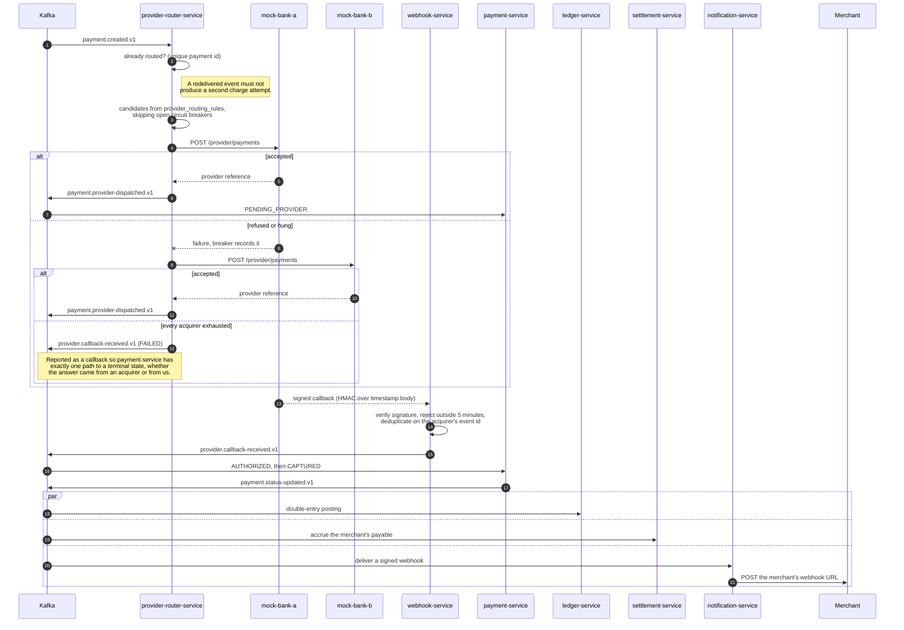

# From `payment.created.v1` to `CAPTURED`

The asynchronous half. Nothing here is driven by the merchant; a full local run takes about three
seconds.

## Why the timestamp is inside the signature

The HMAC covers `timestamp.body`, not `body`. Signing the body alone means a captured callback stays
replayable forever: an attacker resends it with a fresh timestamp header and the signature still
verifies. Binding the timestamp into the signed material is what makes the five-minute window mean
anything.

Deduplication on the acquirer's event id is the second half. Acquirers genuinely redeliver, so a
duplicate has to be safe — and a duplicate *capture* that got through would credit a merchant twice.

## Why routing failure is reported as a callback

Running out of acquirers is an outcome, not an absence of one. If it were not published, a payment
nobody could route would sit in `CREATED` forever with nothing to explain why. Publishing it on the
same topic as a real acquirer answer means payment-service has one path that moves a payment to a
terminal state, rather than two that must be kept in agreement.

## Ordering

Routing notifications and provider callbacks travel on different topics, so nothing orders them
relative to each other. A callback processed before the dispatch notification is normal, which is
why `CREATED` accepts `AUTHORIZED` and `CAPTURED` directly rather than only `PENDING_PROVIDER` —
refusing them would drop the real outcome and strand the payment when the late notification arrived.
