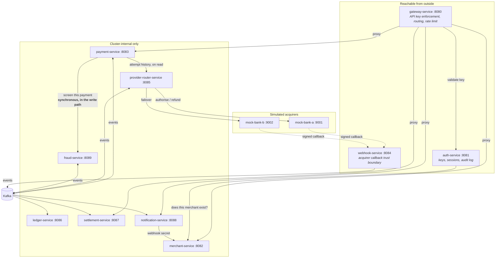

# Services and how they reach each other

## Reading it

**Solid arrows are synchronous HTTP. Dotted ones cross a trust boundary.** Everything through Kafka
is asynchronous and at-least-once, which is why every consumer here is idempotent.

**There are only four synchronous service-to-service calls, and each one is a deliberate exception**
to the event-driven default:

| Call | Why not an event |
| --- | --- |
| gateway → auth | A request cannot be routed before it is known who is making it |
| payment → fraud | The gate has to answer before the payment is written, or it is not a gate |
| payment → router | Attempt history has one owner; a second copy would be a second truth |
| notification → merchant | The signing secret must be the current one at the moment of delivery |

The first three are on the request path and carry tight timeouts for that reason: 2s/3s for key
validation, 500ms/1s for screening — see [ADR-0003](../adrs/0003-fraud-gate-fails-open.md) for what
happens when the last of those is exceeded.

**Every service owns its own database.** None of them appears in this diagram because no service
reads another's; that is what makes the arrows above the complete list of coupling.

## Why the split into two boxes

The three services in the top box are the only ones an ingress publishes. Everything else — the
ledger, the review queue, settlement runs, the routing table, dead-letter replay — is guarded by a
shared operator token, which is a reasonable control inside a cluster and a poor one facing the
internet. The [network policy](../../platform/k8s/60-network-policy.yaml) enforces the same split at
the socket level, because the token tiers guard HTTP handlers and not ports.
