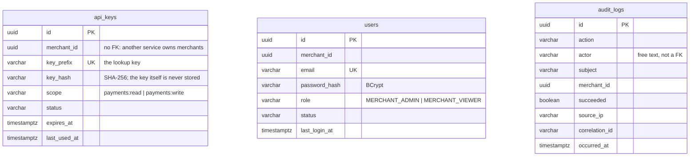
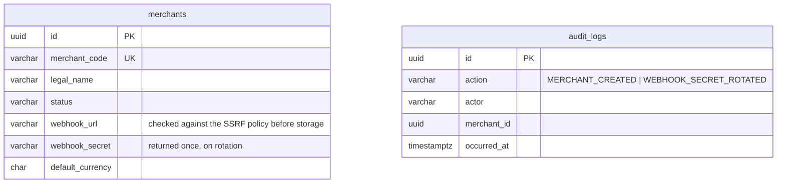
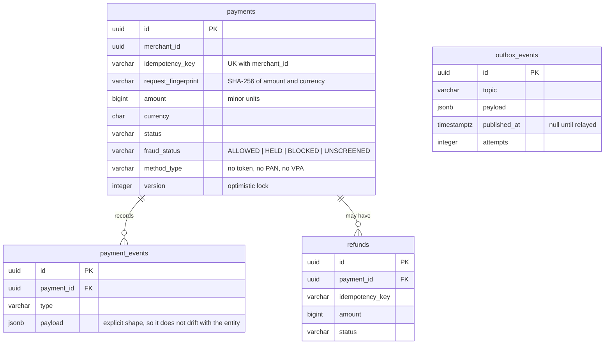
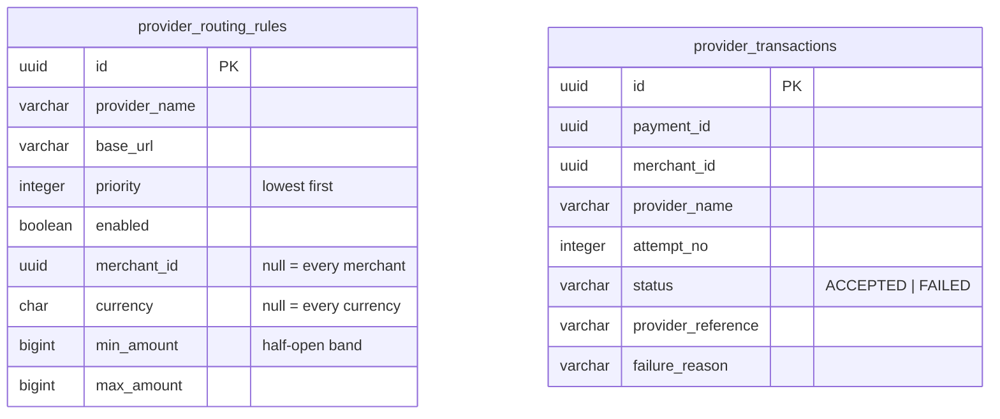
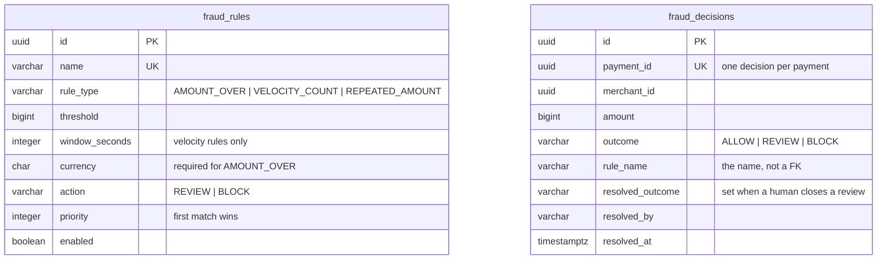
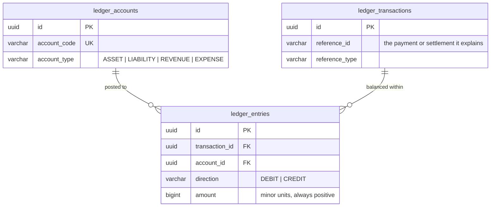
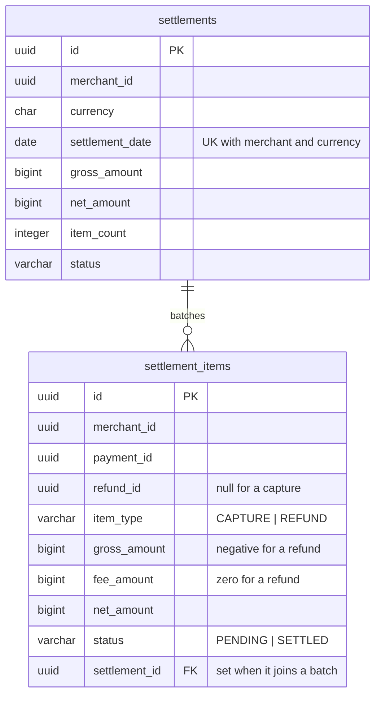
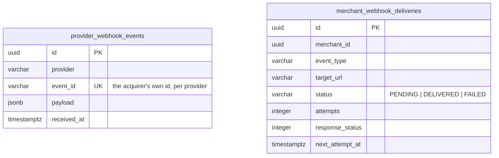

# Data model

Nine databases, one per service. No service reads another's, and there is not a single foreign key
that crosses a service boundary — so the relationships drawn *between* the boxes below are
application-level references, held together by ids and by events rather than by the database.

Drawn per service, because that is how it is enforced.

## auth-service — `openpay_auth`

`api_keys` stores a prefix and a hash, never the key. The prefix is what makes lookup a single
indexed read without the hash having to be reversible.

`audit_logs.actor` is free text rather than a foreign key. The actor may be someone this service has
no row for — an unknown email at a failed login, an operator holding a token — and a log that can
only describe actors it already knows about is missing exactly the entries worth having.

## merchant-service — `openpay_merchant`

A second `audit_logs`, not a shared one. A central audit table would make every service's writes
depend on a schema none of them owns, and would be the single outage that stops the whole platform
recording anything.

## payment-service — `openpay_payment`

`(merchant_id, idempotency_key)` is unique, and that constraint is the concurrency control: two
racing requests both attempt the insert, one wins, and the loser re-reads and returns the winner's
payment.

`request_fingerprint` is what makes replaying a key with a *different* body a `409` rather than a
silently wrong `200`.

`fraud_status` is a separate column rather than extra statuses — see
[state-machine.md](state-machine.md).

## provider-router-service — `openpay_router`

`provider_transactions` is why a payment that ended up on the second acquirer can still show what
was tried first and why it was abandoned. The row is written *before* the call, not after.

The unique constraint on the rules table is `NULLS NOT DISTINCT`, because every narrowing column is
nullable and the general case is all three null — under the default, NULLs never collide and the
constraint would permit unlimited duplicate general rules.

## fraud-service — `openpay_fraud`

`rule_name` is stored rather than a foreign key to `fraud_rules`, and rules are disabled rather than
deleted, for the same reason: a deleted rule would take with it the only explanation for every
decision that cites it.

The resolution columns sit beside the original outcome rather than overwriting it. How a payment was
first judged and what an operator decided about it are two different facts, and merging them
destroys the only record that a review ever happened.

## ledger-service — `openpay_ledger`

Append-only, enforced by the database rather than by convention: there is no `UPDATE` or `DELETE`
path to `ledger_entries` in the application, and a balance is derived from the journal rather than
stored beside it. A stored balance is a second truth that can disagree with the entries.

## settlement-service — `openpay_settlement`

The two levels are what let a payment be accrued the moment it is captured but paid out on a
schedule, and what makes a payout auditable back to the payments inside it.

`(merchant_id, currency, settlement_date)` is unique so that running the job twice cannot produce
two payouts for the same money.

## webhook-service and notification-service

`event_id` unique per provider is the deduplication. Acquirers redeliver, and a duplicate capture
that got through would credit a merchant twice.

## What money looks like everywhere

`BIGINT`, in the currency's smallest unit — paise, cents. Never a floating point type, and never a
`DECIMAL` that some code path might read as a double. Jackson is configured to reject a fractional
amount outright rather than truncate `10.99` to `10`.
