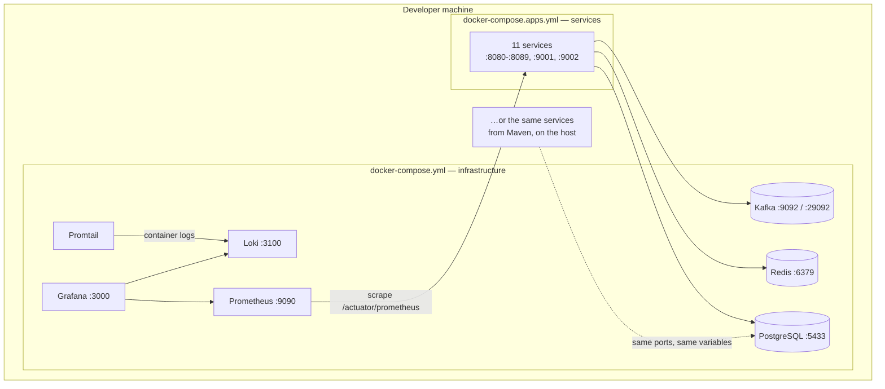
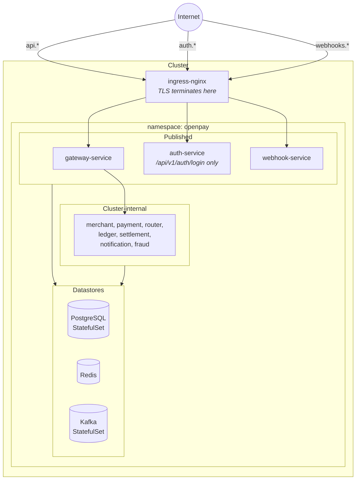
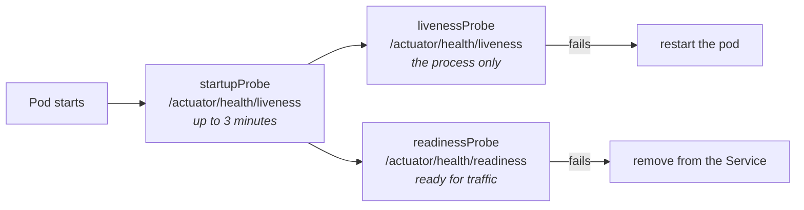

# Deployment

Two topologies, one set of jars. Every service is configured entirely through environment variables,
which is what makes the same artefact runnable on a laptop, in Compose, and in a cluster without a
separate profile.

## Local

**Kafka advertises two addresses**, and it has to. A container resolves `kafka:29092`; a process on
the host cannot, and needs `localhost:9092`. Advertising only one of them leaves every client on the
other side unable to connect after its first metadata fetch — which looks like a working broker
until the first consumer starts.

**Prometheus scrapes two addresses per service** for the same reason, and accepts that whichever
workflow is not in use leaves a permanently red target. That is the honest trade: one red row in the
Prometheus UI, in exchange for metrics that work in both workflows without editing a file.

## Kubernetes

**Three hosts published, nothing else.** Every operator surface — the ledger, the review queue,
settlement runs, the routing table, the audit log, dead-letter replay — is guarded by a shared
token, and a shared token is a reasonable control inside a cluster and a poor one facing the
internet. They are reached with `kubectl port-forward` or an internal-only ingress.

**The network policy enforces the same split at the socket level.** The token tiers guard HTTP
handlers, not ports: without a policy, a compromised mock-bank pod opens a connection straight to
the payments database and none of them apply.

**Replica counts are reasoned, not uniform.** payment-service scales because the outbox relay claims
rows with `FOR UPDATE SKIP LOCKED`; provider-router-service does not, because its circuit breaker
state is per instance; settlement-service does not, because its job is scheduled. See
[platform/k8s/README.md](../../platform/k8s/README.md).

## Probes

Three probes rather than one, and each answers a different question:

- **Startup** is generous because a service applying Flyway migrations to a cold database takes far
  longer to start than it ever takes to answer once running. One probe for both would mean choosing
  between killing a pod mid-migration and taking a minute to notice a hung one.
- **Liveness** reports on the process and nothing else. A liveness probe that fails because a
  *dependency* is unwell restarts a healthy pod, and during a database blip that becomes a restart
  loop across the whole platform at the worst possible moment.
- **Readiness** uses `/actuator/health/readiness`, not the aggregate `/actuator/health` — which
  includes dependencies, and would therefore pull a pod out of rotation because something downstream
  is unwell, turning one service's problem into everyone's outage.
