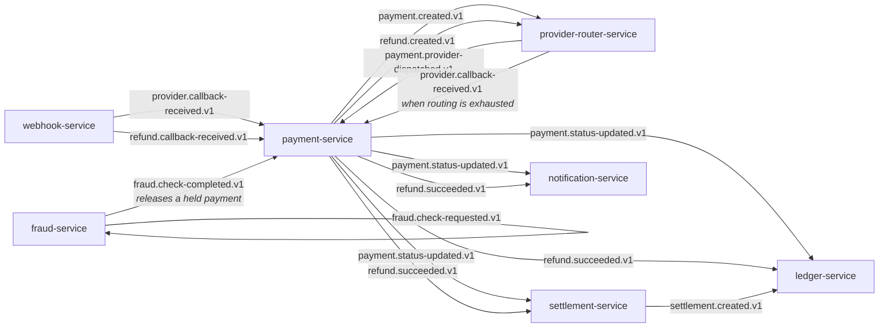

# Events

Ten topics. Every one is keyed by the aggregate it concerns, so a partition holds one payment's
events in order.

## The catalogue

| Topic | Key | Produced by | Consumed by |
| --- | --- | --- | --- |
| `payment.created.v1` | payment id | payment-service | provider-router-service |
| `payment.provider-dispatched.v1` | payment id | provider-router-service | payment-service |
| `payment.status-updated.v1` | payment id | payment-service | ledger, settlement, notification |
| `provider.callback-received.v1` | payment id | webhook-service, provider-router-service | payment-service |
| `refund.created.v1` | refund id | payment-service | provider-router-service |
| `refund.callback-received.v1` | refund id | webhook-service | payment-service |
| `refund.succeeded.v1` | refund id | payment-service | ledger, settlement, notification |
| `settlement.created.v1` | settlement id | settlement-service | ledger-service |
| `fraud.check-requested.v1` | payment id | fraud-service | risk analytics (nothing yet) |
| `fraud.check-completed.v1` | payment id | fraud-service | payment-service |

Each has a dead-letter counterpart: `payment.created.v1` becomes `payment.created.dlq.v1`. The
version stays on the end so a DLQ message keeps the schema of the topic it came from, and a replay
tool reading it knows exactly what it is holding.

## Why `.v1` is in the name

A breaking change to a payload publishes to a new topic rather than mutating the old one. Consumers
migrate on their own schedule, and the two versions coexist while they do. Renaming a field in place
would mean every consumer has to deploy in the same window as the producer, which across seven
services is not a deployment, it is an outage with a plan.

## Two topics that look redundant

**`provider.callback-received.v1` has two producers.** webhook-service publishes it when an acquirer
answers; provider-router-service publishes it when *no* acquirer will. Both are outcomes, and
routing them down the same path means payment-service has exactly one place that moves a payment to
a terminal state rather than two that have to be kept in agreement.

**`fraud.check-completed.v1` carries every decision**, including the ones payment creation already
acted on synchronously. That is deliberate: a held payment is released by this event and nothing
else, so the topic is one mechanism rather than a special case bolted onto the review queue.
payment-service ignores an event for a payment that was never held, which is most of them.

## At-least-once, everywhere

Kafka delivers at least once, and acquirers redeliver on top of that. Every consumer here is
idempotent, by construction rather than by hope:

- **provider-router-service** checks for an existing `provider_transaction` before dispatching, so a
  redelivered `payment.created` cannot produce a second charge attempt.
- **payment-service** treats a transition to the state it is already in as a duplicate, and *drops*
  an out-of-order transition rather than throwing — throwing would put the consumer in a redelivery
  loop over a message that can never succeed.
- **ledger-service** and **settlement-service** enforce uniqueness on the payment id, so the same
  capture cannot post twice or accrue twice.
- **webhook-service** deduplicates on the acquirer's own event id before publishing anything.

## When a consumer cannot cope

Three quick retries, then the dead-letter topic — carrying the exception type, message, and stack
trace in its headers. Spring Kafka's default is ten retries and then a log line, which in a payment
system is the worst option available: the event is gone, nothing alerts, and a payment simply stops
advancing with no trace of why.

Retries are few and fast on purpose. Most failures are either transient, where two retries fix them,
or structural, where a thousand will not — and a consumer stuck retrying a poison message is a
consumer not processing the payments behind it.

Getting a message back out is `/internal/dlq` on the service that consumes the topic: peek without
committing, replay to the original topic, or discard explicitly. Nothing replays on a schedule,
because automatic replay is how a poison message becomes an infinite loop.
