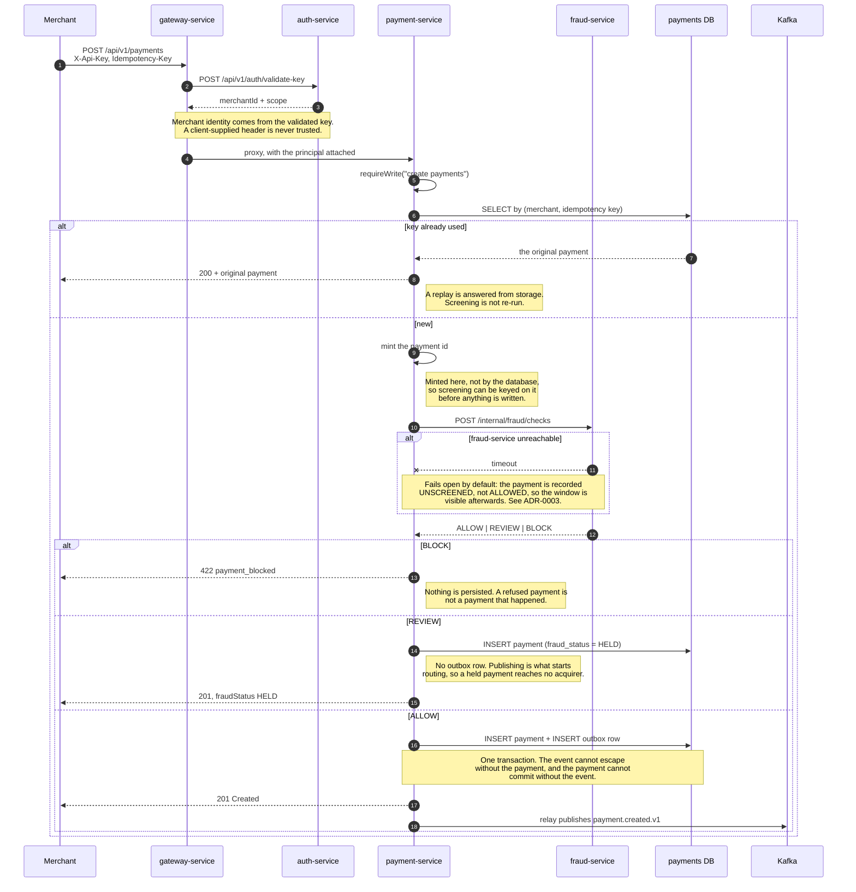

# Creating a payment

The synchronous half. Everything after the `201` happens on its own — see
[callback-sequence.md](callback-sequence.md).

## The three things worth noticing

**The idempotency check comes before screening.** A retried creation gets the answer it already got.
Re-running the rules would evaluate against a velocity window that has moved since, so the same
payment could be allowed on one attempt and blocked on the next.

**The payment id is minted in the application.** That is what makes the fraud gate idempotent: the
decision is keyed on an id that exists before any row does.

**The outbox row and the payment row commit together.** This is the whole reason for the outbox.
Publishing to Kafka after the commit leaves a window where the payment exists and the event does
not; publishing before leaves one where the event exists and the payment does not. Both windows are
lost or duplicated money — see [ADR-0001](../adrs/0001-transactional-outbox.md).

## Concurrency

Two requests racing on the same idempotency key both reach the insert. The unique constraint on
`(merchant_id, idempotency_key)` picks a winner; the loser catches the violation, re-reads, and
returns the winner's payment. No lock, and no window where two payments exist for one key.
