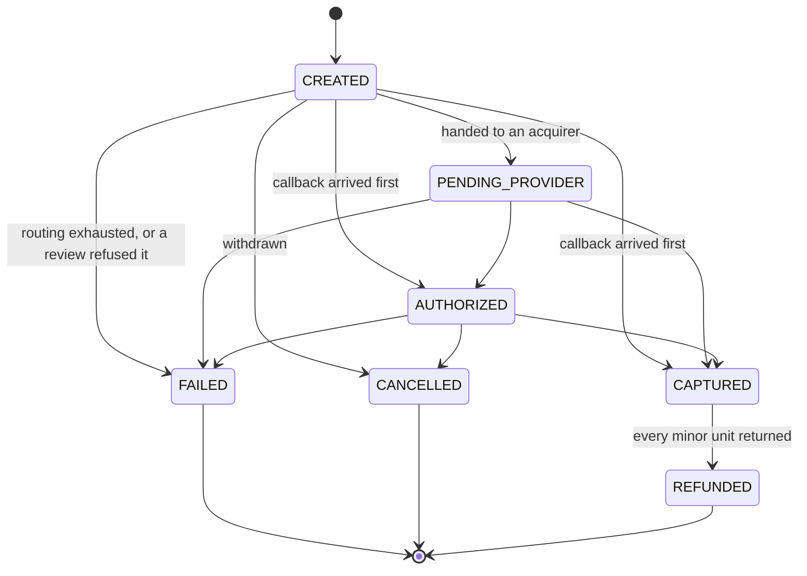
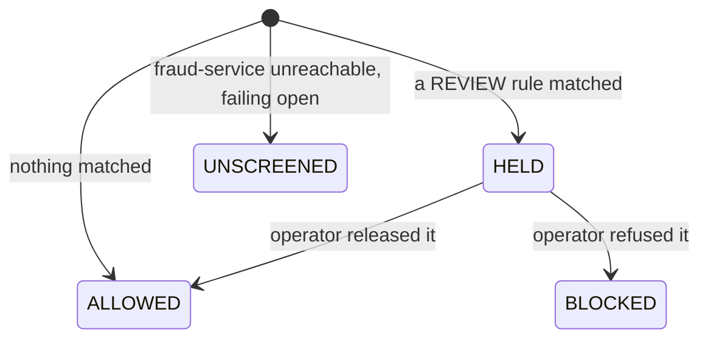
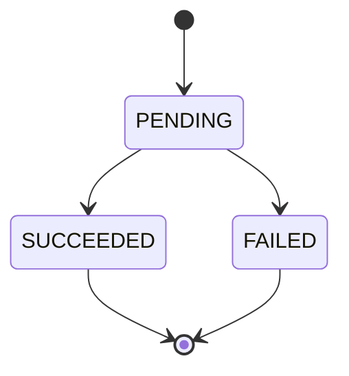

# Payment lifecycle

Two orthogonal facts, kept in two columns.

## Status

The rule lives on the entity, so no caller can move a payment somewhere the machine does not allow —
and there is no API that transitions a payment at all. A merchant cannot advance its own payment;
only a signature-verified acquirer callback, or the router giving up, can finish one.

### The two edges that look wrong

**`CREATED` accepts `AUTHORIZED` and `CAPTURED` directly.** Routing notifications and provider
callbacks are separate topics, so nothing orders them. When a callback is processed first, refusing
it would drop the real outcome and leave the payment stranded in `PENDING_PROVIDER` once the late
notification landed. Reaching `AUTHORIZED` already implies an acquirer answered, so accepting it
loses no safety.

**`CAPTURED` leads only to `REFUNDED`.** A partial refund does not move the payment at all. The
refunds themselves carry that detail, and a status that meant "partly refunded" would need an amount
next to it to be useful — at which point it is not a status.

## Screening

Deliberately a separate column, not extra statuses:

A held payment is still `CREATED`, and a released one is still `CREATED`. Folding this into the
status machine would mean a `HELD` state that has to be unwound back into whatever it interrupted,
and every consumer would have to know which states `HELD` could return to.

`UNSCREENED` is separate from `ALLOWED` on purpose: "we decided this was fine" and "nobody looked"
are different claims, and only one of them should turn up in a chargeback dispute.

`BLOCKED` at creation time never reaches this diagram — the payment is not persisted at all, because
a refused payment is not a payment that happened. `BLOCKED` here is only ever the result of a review
being closed against a payment that was already stored.

## Refunds

A refund goes back to the acquirer that took the payment, never to whichever one is currently
preferred. Failing over is not an option when the money is held somewhere specific — which is why
`baseUrlFor` resolves disabled routing rules too.
