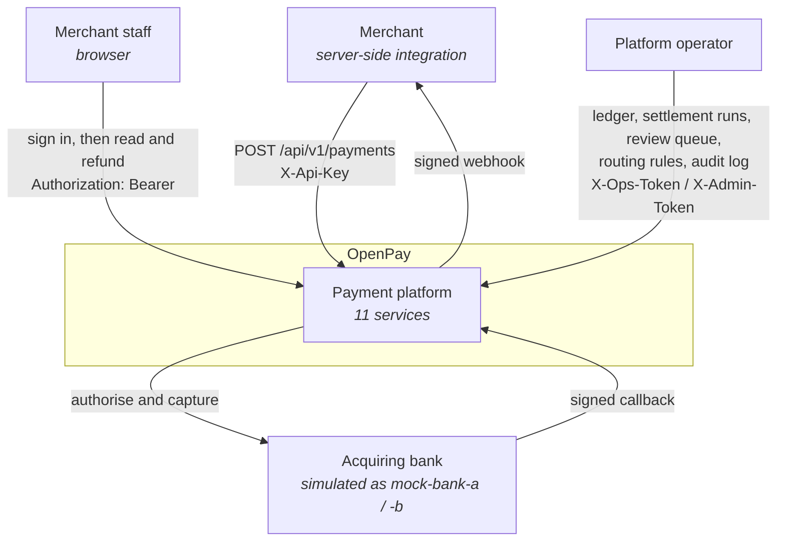

# System context

Who uses OpenPay, and what OpenPay depends on.

## What the arrows say

**Merchants push, the platform pushes back.** A payment is created synchronously and completed
asynchronously, so a merchant that only ever polls will see a payment sitting in `CREATED` and
conclude nothing happened. The outbound webhook is not a convenience; it is how an integration
finds out the answer.

**Acquirer callbacks are inbound from an untrusted party.** They arrive at webhook-service, which
verifies an HMAC over `timestamp.body` and deduplicates on the acquirer's own event id. That is the
only ingress point on the platform that is not authenticated by a credential the platform issued.

**Operators are a first-class caller, not an afterthought.** Three of the four credential types
exist for them, and they are split by what the action can do rather than by who is doing it — see
[ADR-0002](../adrs/0002-three-credential-tiers.md).

## What is deliberately absent

There is no payout rail. Settlement batches what a merchant is owed and clears the payable in the
ledger, and then nothing sends money anywhere. Every acquirer here is simulated, so no funds ever
leave a database — which is stated plainly rather than drawn as a box that does not exist.
